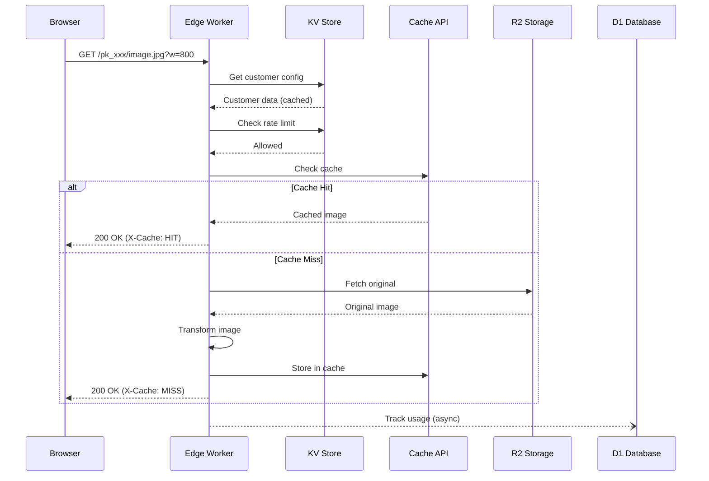
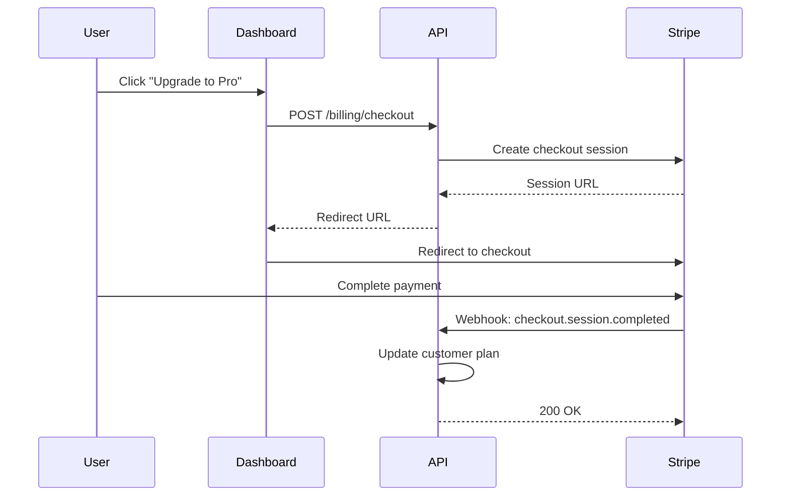

# ImageCDN Architecture Overview

## System Architecture

ImageCDN is designed as an edge-first image optimization platform with the following key components:

### 1. Edge Layer (Cloudflare Workers)

The edge layer handles all image requests with minimal latency:

```
Request Flow:
┌─────────┐    ┌─────────────┐    ┌─────────────┐    ┌──────────┐
│ Browser │───▶│ Edge Worker │───▶│ Cache Check │───▶│ Response │
└─────────┘    └─────────────┘    └──────┬──────┘    └──────────┘
                                         │
                                    Cache Miss
                                         │
                                         ▼
                                  ┌─────────────┐
                                  │  R2 Fetch   │
                                  └──────┬──────┘
                                         │
                                         ▼
                                  ┌─────────────┐
                                  │  Transform  │
                                  └──────┬──────┘
                                         │
                                         ▼
                                  ┌─────────────┐
                                  │ Cache Store │
                                  └─────────────┘
```

**Responsibilities:**
- URL parsing and parameter validation
- API key verification (via KV cache)
- Rate limiting (sliding window in KV)
- Image fetching from R2
- Image transformation (via Cloudflare Image Resizing)
- Response caching (Cache API)
- Usage tracking (async to D1)

### 2. Storage Layer (Cloudflare R2)

Original images are stored in R2 with the following structure:

```
imagecdn-images/
├── {public_key}/
│   ├── images/
│   │   ├── hero.jpg
│   │   └── products/
│   │       └── item-001.png
│   └── assets/
│       └── logo.svg
```

**Features:**
- S3-compatible API
- Zero egress fees
- Multi-region replication
- Presigned URL uploads

### 3. Backend API (NestJS)

The backend API handles all non-edge operations:

```
┌─────────────────────────────────────────────────────────────┐
│                      Backend API                             │
├─────────────────────────────────────────────────────────────┤
│  ┌───────────┐  ┌───────────┐  ┌───────────┐  ┌──────────┐ │
│  │   Auth    │  │ Customers │  │  Billing  │  │  Images  │ │
│  │  Module   │  │  Module   │  │  Module   │  │  Module  │ │
│  └───────────┘  └───────────┘  └───────────┘  └──────────┘ │
│  ┌───────────┐  ┌───────────┐  ┌───────────┐               │
│  │   Usage   │  │ Webhooks  │  │ Internal  │               │
│  │  Module   │  │  Module   │  │  Module   │               │
│  └───────────┘  └───────────┘  └───────────┘               │
└─────────────────────────────────────────────────────────────┘
```

**Modules:**
- **Auth**: JWT tokens, API key generation
- **Customers**: Profile, settings, domain restrictions
- **Billing**: Stripe integration, plans, invoices
- **Images**: Upload URLs, listing, deletion
- **Usage**: Analytics, quota checking
- **Webhooks**: Stripe event handling
- **Internal**: Edge worker communication

### 4. Dashboard (Next.js)

Customer-facing dashboard with:

- **Overview**: Usage stats, quick start
- **Images**: Browse, upload, manage
- **Usage**: Detailed analytics, quota status
- **API Keys**: Generate, rotate, manage
- **Billing**: Plans, invoices, portal
- **Settings**: Domains, defaults, security

## Data Flow

### Image Request Flow



### Billing Flow



## Caching Strategy

### Edge Cache (Cache API)

- **Scope**: Per-POP (not global)
- **Key**: `imagecdn:{pk}:{path}:{params_hash}`
- **TTL**: 1 year (immutable assets)
- **Purge**: Via API or dashboard

### Customer Config Cache (KV)

- **Key**: `customer:{public_key}`
- **TTL**: 5 minutes
- **Refresh**: On config change via webhook

### Rate Limit Cache (KV)

- **Key**: `ratelimit:{pk}:{second}`
- **TTL**: 2 seconds
- **Strategy**: Sliding window counter

## Security Model

### Authentication

| Context | Method | Token Type |
|---------|--------|------------|
| Dashboard | JWT | Bearer token |
| API | API Key | X-API-Key header |
| CDN | Public Key | URL path |
| Internal | Secret | Bearer token |

### Authorization

```
Customer Plan → Features + Limits
                    │
                    ├── AVIF Support
                    ├── Signed URLs
                    ├── Custom Domains
                    ├── Max Dimensions
                    ├── Rate Limits
                    └── Bandwidth Quota
```

### Domain Restrictions

Optional per-customer domain allowlist:
- Checked via `Origin` and `Referer` headers
- Supports wildcards (`*.example.com`)
- Bypass for server-to-server requests

## Scalability

### Horizontal Scaling

- **Edge Workers**: Auto-scaled by Cloudflare
- **Backend API**: Stateless, can run multiple instances
- **Database**: Migrate to managed PostgreSQL for scale

### Performance Optimization

1. **Cache Everything**: Immutable transformed images
2. **Async Processing**: Usage tracking never blocks
3. **Edge Config**: Customer data at edge via KV
4. **Batch Operations**: Bulk usage writes to D1

## Monitoring & Observability

### Metrics

- Request count by status code
- Cache hit/miss ratio
- Transform latency percentiles
- Bandwidth usage by customer
- Error rates by type

### Alerting

- Cache hit rate < 80%
- Error rate > 1%
- Latency p99 > 500ms
- Quota exceeded events

## Disaster Recovery

### Data Durability

- R2: Multi-region replication
- D1: Automatic backups
- KV: Edge-replicated

### Failover

- Edge: Automatic via Cloudflare anycast
- API: Health checks + load balancer
- Stripe: Webhook retry with idempotency
